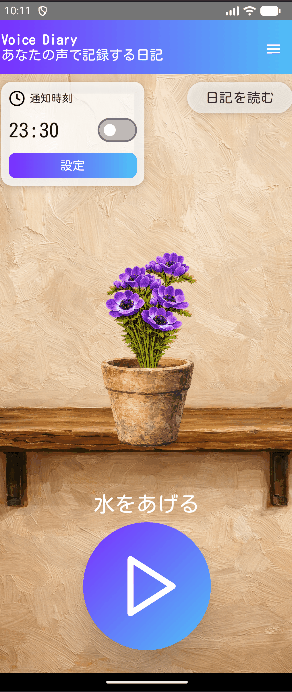

# Hanaki - Voice Diary App 🌸

音声で日記を記録し、言葉と感情が花として成長する体験型アプリです。  
Hanaki is an Android voice diary app where your words and emotions grow into a flower through interactive UI/UX.

---

## 🎥 Demo

---

## 📱 Overview

Hanaki is an Android application that transforms daily voice recordings into a visual growth experience.

Instead of simply storing text, this app focuses on emotional expression and UX.  
Users "water" a flower with their voice, select emotions, and watch the flower grow over time.

---

## ✨ Features

- Voice recording diary
- Flower growth system based on voice input and emotions
- Emotion selection UI
- Watering animation linked to user input
- Archive of past entries

---

## 🧠 Concept

This app is designed around the idea:

> “Your words are not just recorded — they are remembered and grown.”

- Voice input → Water
- Emotion → Growth variation
- Daily use → Flower lifecycle

The goal is to create a natural and intuitive UX that feels understandable without heavy explanation.

---

## 🛠 Tech Stack

- Kotlin
- Jetpack Compose
- MVVM Architecture
- Room
- Android Studio

---

## ✅ Current Status

Implemented:
- Basic voice diary flow
- UI/UX animation for watering and flower interaction
- Emotion selection flow
- Local data layer with Room

Planned / In Progress:
- AI transcription
- Cloud sync
- Premium flowers / backgrounds
- Seasonal variations

---

## 🎯 Why I built this

I wanted to explore how UX and emotional interaction can be integrated into a diary app.

Rather than focusing only on functionality, this project emphasizes:
- User experience design
- Animation-driven interaction
- Intuitive flow without heavy explanation

---

## ⚠️ Note

This project is still under development.  
Some features may be incomplete or subject to change.

---

## 📄 License

This repository is published for portfolio purposes.  
No reuse license is currently granted.
